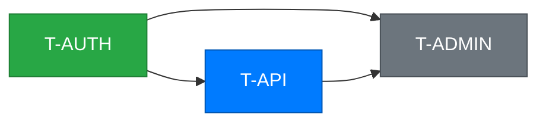

# Component Designs

> **Date:** 2026-02-08
> **Purpose:** Detailed designs for key new components in Architect v2.1, including interfaces, data flow, and implementation specifics.

---

## 1. Scope Analyzer (`scripts/scope_analyzer.py`)

### Purpose
Given a feature description and existing architecture state, decide whether the feature needs 1 track or N tracks, identify which architectural boundaries are crossed, and output a decomposition recommendation.

### Interface

**Input (JSON via stdin or CLI args):**
```json
{
  "feature_description": "Add role-based access control",
  "architecture_state": {
    "existing_tracks": [
      {"id": "T-AUTH", "status": "complete", "wave": 1, "boundaries": ["data", "api"]},
      {"id": "T-API", "status": "in_progress", "wave": 2, "boundaries": ["api"]},
      {"id": "T-FRONTEND", "status": "pending", "wave": 3, "boundaries": ["ui"]}
    ],
    "cross_cutting_version": "1.2",
    "architecture_components": ["auth-service", "api-gateway", "frontend-app", "postgres-db"],
    "tech_stack_summary": "Node.js, Express, React, PostgreSQL, JWT"
  },
  "clarifications": {
    "role_model": "hierarchical",
    "predefined_roles": 5
  }
}
```

**Output (JSON to stdout):**
```json
{
  "recommendation": "multi_track",
  "confidence": 0.85,
  "reasoning": "Feature crosses 3 boundaries (data model, API middleware, UI components) with non-atomic changes",
  "tracks": [
    {
      "suggested_id": "T-RBAC-MODEL",
      "scope": "Role data model, migration, seed data",
      "boundaries": ["data"],
      "depends_on": ["T-AUTH"],
      "estimated_complexity": "M",
      "cross_cutting_concerns": ["CC v1.2: All database migrations must be reversible"]
    },
    {
      "suggested_id": "T-RBAC-GATES",
      "scope": "API middleware, permission checks, UI route guards",
      "boundaries": ["api", "ui"],
      "depends_on": ["T-RBAC-MODEL", "T-API"],
      "estimated_complexity": "M",
      "cross_cutting_concerns": ["CC v1.2: All database migrations must be reversible", "CC v1.1: All API endpoints require authentication"]
    }
  ],
  "alternative": {
    "recommendation": "single_track",
    "condition": "If roles are flat (not hierarchical) with < 3 predefined roles",
    "reasoning": "Simple flat roles can be implemented atomically within the auth track"
  },
  "clarification_needed": false,
  "missing_clarifications": []
}
```

### Decision Tree Logic

```python
def analyze_scope(feature, architecture_state, clarifications):
    """
    Returns decomposition recommendation.

    Step 1: Check if clarification is needed
    Step 2: Identify boundaries crossed
    Step 3: Check atomicity
    Step 4: Check existing track coverage
    Step 5: Generate track recommendations
    """

    # Step 1: Detect underspecification
    # Look for ambiguous terms: "make it better", "improve", "optimize"
    # Look for missing slot values: auth without method, data without schema
    ambiguity_signals = detect_ambiguity(feature.description)
    if ambiguity_signals and not clarifications:
        return {
            "recommendation": "needs_clarification",
            "questions": generate_targeted_questions(ambiguity_signals, max=3)
        }

    # Step 2: Boundary analysis
    # Boundaries: data_model, api_layer, ui_layer, infrastructure, external_integration
    boundaries = identify_boundaries(feature, architecture_state.tech_stack)

    # Step 3: Atomicity check
    if len(boundaries) <= 1:
        return single_track_recommendation(feature, boundaries[0])

    if is_atomic(feature, boundaries):
        # Multiple boundaries but must deploy together
        return single_track_recommendation(feature, boundaries)

    # Step 4: Existing track coverage
    for boundary in boundaries:
        matching_track = find_covering_track(boundary, architecture_state.existing_tracks)
        if matching_track and matching_track.status == "in_progress":
            # Recommend TRACK_EXTENSION rather than new track
            mark_as_extension(boundary, matching_track)

    # Step 5: Generate multi-track recommendation
    tracks = generate_track_split(feature, boundaries, architecture_state)
    validate_no_cycles(tracks, architecture_state.existing_tracks)

    return multi_track_recommendation(tracks)
```

### Boundary Identification Heuristics

| Signal in Feature Description | Boundary | Examples |
|------------------------------|----------|---------|
| "schema", "model", "table", "migration", "column" | data_model | "Add user roles table" |
| "endpoint", "API", "route", "middleware", "controller" | api_layer | "Add permission middleware" |
| "page", "component", "form", "button", "UI", "dashboard" | ui_layer | "Add admin dashboard" |
| "deploy", "config", "environment", "Docker", "CI" | infrastructure | "Add Redis cache" |
| "integrate", "third-party", "webhook", "OAuth", "payment" | external_integration | "Integrate Stripe" |

### Ambiguity Detection

| Signal | Category | Clarification Question |
|--------|----------|----------------------|
| No technology choice specified | Missing slot | "Which [technology category] should be used? Options: [from tech-stack.md]" |
| Vague scope ("improve", "optimize") | Vague scope | "What specific aspect should be [improved/optimized]? Examples: [based on architecture]" |
| Feature name only, no description | Missing detail | "What should [feature] do? Key scenarios to support?" |
| Contradicts existing architecture | Conflict | "[Feature] conflicts with [architecture decision]. Should we change the architecture or adjust the feature?" |

### Trivial Feature Detection

A feature is **too small to track** if ALL of these are true:
- Crosses ≤ 1 boundary
- Affects ≤ 2 files (estimated from scope)
- Has no dependencies on pending tracks
- Has no cross-cutting implications
- Estimated complexity is XS

In this case, output `{"recommendation": "skip_tracking", "reasoning": "..."}`.

---

## 2. Architecture Doc Updater (`scripts/architecture_updater.py`)

### Purpose
Read completed track artifacts, extract implementation decisions, and generate additive patches to `architecture.md`, ADRs, and changelog entries.

### Interface

**Input (CLI args):**
```bash
python architecture_updater.py \
  --track-dir conductor/tracks/T-AUTH/ \
  --architecture-md architect/architecture.md \
  --decisions-dir architect/decisions/ \
  --changelog architect/CHANGELOG.md
```

**Output (JSON to stdout):**
```json
{
  "architecture_patches": [
    {
      "section": "## Components",
      "action": "update_status",
      "target": "auth-service",
      "patch": "Status: ✅ Implemented (T-AUTH)\nTechnology: Express.js + JWT (RS256)\nEndpoints: /auth/login, /auth/refresh, /auth/logout"
    },
    {
      "section": "## Technology Choices",
      "action": "confirm_choice",
      "target": "Authentication",
      "patch": "Authentication: JWT with RS256 (confirmed in T-AUTH, see ADR-003)"
    }
  ],
  "adrs_generated": [
    {
      "filename": "ADR-003-jwt-rs256-over-sessions.md",
      "title": "Use JWT with RS256 over server-side sessions",
      "context": "Auth track needed token strategy for stateless API authentication",
      "decision": "JWT with RS256 for stateless verification and token rotation",
      "consequences": [
        "No server-side session store needed",
        "Token revocation requires blocklist or short expiry",
        "RS256 enables distributed verification without shared secret"
      ]
    }
  ],
  "changelog_entry": {
    "wave": 1,
    "tracks_completed": ["T-AUTH"],
    "summary": "Authentication foundation established: JWT-based auth with RS256 signing, login/refresh/logout endpoints"
  },
  "drift_warnings": []
}
```

### Decision Extraction Pipeline

```
Input: Track's spec.md + plan.md + metadata.json
                    │
                    ▼
┌─────────────────────────────────┐
│  1. Parse spec.md for:          │
│     - Technology choices         │
│     - Pattern selections         │
│     - Interface definitions      │
│     - Rejected alternatives      │
│                                  │
│  Search patterns:                │
│     "chose X over Y"            │
│     "using X for Y"             │
│     "decided to X because"      │
│     "## Design Decisions"       │
│     "## Technology Choices"     │
└──────────────┬──────────────────┘
               │
               ▼
┌─────────────────────────────────┐
│  2. Parse plan.md for:          │
│     - Implementation approach    │
│     - Libraries/frameworks used  │
│     - Endpoint/schema paths      │
│                                  │
│  Search patterns:                │
│     "install X"                  │
│     "create X model/table"      │
│     "define endpoint X"          │
│     Phase descriptions           │
└──────────────┬──────────────────┘
               │
               ▼
┌─────────────────────────────────┐
│  3. Classify decisions:         │
│     - TECHNOLOGY: tool/lib pick  │
│     - PATTERN: arch. pattern     │
│     - INTERFACE: API/event def   │
│     - STRUCTURE: module layout   │
│                                  │
│  ADR-worthy if:                  │
│     - Multiple alternatives were │
│       considered                 │
│     - Decision affects > 1 track │
│     - Decision is irreversible   │
└──────────────┬──────────────────┘
               │
               ▼
┌─────────────────────────────────┐
│  4. Generate outputs:           │
│     - Architecture patches       │
│     - ADR files (if warranted)   │
│     - Changelog entry            │
│     - Drift warnings             │
└─────────────────────────────────┘
```

### Architecture Patch Rules

1. **Additive only** — Never delete content from architecture.md. Only add sections, update status markers, confirm choices.
2. **Section targeting** — Each patch targets a specific `##` section by heading match. If section doesn't exist, append at end.
3. **Status markers** — Use checkmark (✅) for confirmed, arrow (→) for modified, warning (⚠️) for drift.
4. **Cross-reference** — Link to ADR when a decision is confirmed: "JWT (confirmed, see ADR-003)"
5. **Preserve manual edits** — If a section was manually edited (detected via git blame or timestamp heuristic), flag for developer review rather than auto-patching.

### ADR Template

```markdown
# ADR-{NNN}: {Title}

**Date:** {date}
**Status:** Accepted
**Track:** {track_id}

## Context
{Why was this decision needed? What problem does it solve?}

## Decision
{What was decided and why?}

## Alternatives Considered
{What alternatives were evaluated and why were they rejected?}

## Consequences
{What are the positive, negative, and neutral implications?}
- {consequence_1}
- {consequence_2}
```

### ADR Numbering
- Sequential: ADR-001, ADR-002, etc.
- Slug: lowercase, hyphenated summary (e.g., `jwt-rs256-over-sessions`)
- Full filename: `ADR-003-jwt-rs256-over-sessions.md`
- Stored in: `architect/decisions/`

---

## 3. Diagram Generator (`scripts/generate_diagrams.py`)

### Purpose
Generate Mermaid diagram files from existing Architect artifacts (dependency-graph.md, architecture.md, metadata.json).

### Interface

**Input (CLI args):**
```bash
python generate_diagrams.py \
  --dependency-graph architect/dependency-graph.md \
  --architecture architect/architecture.md \
  --tracks-dir conductor/tracks/ \
  --output-dir architect/diagrams/
```

**Output (JSON to stdout + files written):**
```json
{
  "diagrams_generated": [
    {"file": "architect/diagrams/dependency-graph.mmd", "tracks": 12, "edges": 18},
    {"file": "architect/diagrams/component-map.mmd", "components": 8},
    {"file": "architect/diagrams/wave-timeline.mmd", "waves": 4}
  ],
  "warnings": []
}
```

### Dependency Graph Generation

**Input parsing:** Read `architect/dependency-graph.md` which contains a table like:
```markdown
| Track | Depends On |
|-------|-----------|
| T-AUTH | - |
| T-API | T-AUTH |
| T-ADMIN | T-AUTH, T-API |
```

**Status coloring:** Read each track's `metadata.json` for status field.

**Output Mermaid:**


**Large project handling (> 20 tracks):**
- Group completed waves into a single summary node: `Wave1[Wave 1 ✅ 3 tracks]`
- Show in-progress and pending waves in full detail
- Add `click` directives for interactive Mermaid viewers

### Component Map Generation

**Input parsing:** Read `architect/architecture.md` for component sections.

**Output Mermaid:**


```mermaid
architecture-beta
    group api(cloud)[API Layer]
    group data(database)[Data Layer]
    group ui(browser)[Frontend]

    service auth(server)[Auth Service] in api
    service gateway(server)[API Gateway] in api
    service db(database)[PostgreSQL] in data
    service app(browser)[React App] in ui

    auth:R --> L:db
    gateway:R --> L:auth
    app:R --> L:gateway
```

**Fallback:** If architecture.md doesn't have clear component sections, generate a simpler flowchart based on track boundaries.

### Wave Timeline Generation

**Input parsing:** Read `architect/execution-sequence.md` for wave ordering.

**Output Mermaid:**


```mermaid
gantt
    title Project Execution Waves
    dateFormat X
    axisFormat %s

    section Wave 1
    T-AUTH           :done, 0, 1
    T-DB-SCHEMA      :done, 0, 1
    T-CONFIG         :done, 0, 1

    section Wave 2
    T-API            :active, 1, 2
    T-AUTH-MIDDLEWARE :active, 1, 2

    section Wave 3
    T-ADMIN          :2, 3
    T-FRONTEND       :2, 3
```

**Note:** Uses abstract time units (wave numbers), not real dates. The Gantt format is used for visual layout, not project management.

---

## 4. Pattern Detector (`scripts/detect_patterns.py`)

### Purpose
Analyze codebase-analyzer output to identify emerging patterns, cross-cutting behaviors, and repeated structures that should be considered for promotion to cross-cutting concerns.

### Interface

**Input (JSON via stdin):**
```json
{
  "codebase_analysis": {
    "modules": [
      {"path": "src/auth/", "imports": ["express", "jsonwebtoken", "logger", "validator"], "exports": ["authRouter", "authMiddleware"]},
      {"path": "src/api/", "imports": ["express", "logger", "validator", "authMiddleware"], "exports": ["apiRouter"]},
      {"path": "src/admin/", "imports": ["express", "logger", "validator", "authMiddleware"], "exports": ["adminRouter"]}
    ],
    "function_calls": [
      {"name": "logger.error", "locations": ["src/auth/login.js:42", "src/api/users.js:78", "src/admin/roles.js:33", "src/api/products.js:91"]},
      {"name": "validator.validate", "locations": ["src/auth/login.js:15", "src/api/users.js:22", "src/admin/roles.js:11"]}
    ],
    "code_structures": [
      {"pattern": "try/catch with error response", "locations": ["src/api/users.js:70-85", "src/api/products.js:83-98", "src/admin/roles.js:28-43"], "structure": "try { ... } catch (err) { res.status(500).json({ error: err.message }) }"}
    ]
  },
  "existing_cross_cutting": {
    "version": "1.2",
    "constraints": ["CC v1.0: All API endpoints require authentication", "CC v1.1: Use PostgreSQL for persistence", "CC v1.2: All database migrations must be reversible"]
  }
}
```

**Output (JSON to stdout):**
```json
{
  "patterns_detected": [
    {
      "type": "fan_in",
      "name": "Logging (logger module)",
      "evidence": "Imported in 3/3 modules (100%)",
      "fan_in_score": 1.0,
      "is_cross_cutting": true,
      "already_tracked": false,
      "recommendation": "Consider adding CC: 'All modules must use centralized logger for error and access logging'"
    },
    {
      "type": "fan_in",
      "name": "Validation (validator module)",
      "evidence": "Imported in 3/3 modules (100%)",
      "fan_in_score": 1.0,
      "is_cross_cutting": true,
      "already_tracked": false,
      "recommendation": "Consider adding CC: 'All API input must be validated using validator module'"
    },
    {
      "type": "repetition",
      "name": "Error response format",
      "evidence": "Same try/catch error response structure in 3 locations across 2 modules",
      "occurrences": 3,
      "locations": ["src/api/users.js:70-85", "src/api/products.js:83-98", "src/admin/roles.js:28-43"],
      "is_cross_cutting": true,
      "already_tracked": false,
      "recommendation": "Consider adding CC: 'All API error responses must use consistent format: {error: string, code?: string}'"
    }
  ],
  "summary": {
    "total_patterns": 3,
    "cross_cutting_candidates": 3,
    "already_tracked": 0,
    "new_recommendations": 3
  }
}
```

### Detection Algorithms

#### Fan-In Analysis
```python
def calculate_fan_in(modules):
    """
    Count how many modules import each dependency.
    High fan-in (>50% of modules) suggests cross-cutting behavior.
    """
    import_counts = {}
    total_modules = len(modules)

    for module in modules:
        for imp in module.imports:
            import_counts[imp] = import_counts.get(imp, 0) + 1

    cross_cutting = []
    for imp, count in import_counts.items():
        fan_in_score = count / total_modules
        if fan_in_score > 0.5:  # More than half of modules
            cross_cutting.append({
                "type": "fan_in",
                "name": imp,
                "fan_in_score": fan_in_score,
                "evidence": f"Imported in {count}/{total_modules} modules ({fan_in_score:.0%})"
            })

    return cross_cutting
```

#### Repetition Detection
```python
def detect_repetitions(code_structures, threshold=3):
    """
    Identify code structures that appear in 3+ locations across 2+ modules.
    Uses structural similarity rather than exact matching.
    """
    candidates = []

    for structure in code_structures:
        if len(structure.locations) >= threshold:
            # Check locations span multiple modules
            modules = set(loc.split('/')[1] for loc in structure.locations)
            if len(modules) >= 2:
                candidates.append({
                    "type": "repetition",
                    "name": structure.pattern,
                    "occurrences": len(structure.locations),
                    "locations": structure.locations,
                    "evidence": f"Same structure in {len(structure.locations)} locations across {len(modules)} modules"
                })

    return candidates
```

#### Cross-Cutting Classification
```python
# Known cross-cutting categories (from cross-cutting-catalog.md)
ALWAYS_EVALUATE = [
    "logging", "error_handling", "authentication", "authorization",
    "input_validation", "configuration", "monitoring", "testing"
]

IF_MULTI_SERVICE = ["service_discovery", "circuit_breaking", "distributed_tracing", "api_gateway", "event_bus"]
IF_USER_FACING = ["i18n", "accessibility", "rate_limiting"]
IF_DATA_HEAVY = ["caching", "connection_pooling", "migration_strategy", "backup"]

def classify_pattern(pattern, architecture_state):
    """Check if detected pattern matches a known cross-cutting category."""
    for category in ALWAYS_EVALUATE:
        if category_matches(pattern.name, category):
            return {"is_cross_cutting": True, "category": category, "priority": "always"}

    if architecture_state.is_multi_service:
        for category in IF_MULTI_SERVICE:
            if category_matches(pattern.name, category):
                return {"is_cross_cutting": True, "category": category, "priority": "multi_service"}

    # ... similar for IF_USER_FACING, IF_DATA_HEAVY

    return {"is_cross_cutting": False}
```

### Deduplication Against Existing Constraints

Before recommending promotion, check if the pattern is already covered by existing cross-cutting constraints. Use word-overlap matching (same Jaccard > 0.7 threshold as `merge_discoveries.py`) to detect semantic duplicates.

---

## 5. Feature Context Builder (`scripts/feature_context.py`)

### Purpose
Prepare a context bundle for feature decomposition that includes existing architecture state, completed track summaries, active constraints, and relevant codebase structure. Similar to `prepare_brief_context.py` but optimized for feature analysis rather than initial decomposition.

### Interface

**Input (CLI args):**
```bash
python feature_context.py \
  --feature-description "Add role-based access control" \
  --conductor-dir conductor/ \
  --architect-dir architect/
```

**Output (JSON to stdout):**
```json
{
  "feature_description": "Add role-based access control",
  "architecture_summary": {
    "components": ["auth-service", "api-gateway", "frontend-app", "postgres-db"],
    "confirmed_technologies": {"auth": "JWT/RS256", "database": "PostgreSQL", "api": "Express.js"},
    "component_map_excerpt": "..."
  },
  "existing_tracks": [
    {
      "id": "T-AUTH",
      "title": "Authentication Foundation",
      "status": "complete",
      "wave": 1,
      "boundaries": ["data", "api"],
      "key_decisions": ["JWT with RS256", "stateless auth"],
      "interfaces_provided": ["/auth/login", "/auth/refresh", "/auth/logout"]
    },
    {
      "id": "T-API",
      "title": "API Layer",
      "status": "in_progress",
      "wave": 2,
      "boundaries": ["api"],
      "key_decisions": [],
      "interfaces_provided": ["/api/v1/*"]
    }
  ],
  "active_constraints": [
    "CC v1.0: All API endpoints require authentication",
    "CC v1.1: Use PostgreSQL for persistence",
    "CC v1.2: All database migrations must be reversible"
  ],
  "dependency_graph": {
    "nodes": ["T-AUTH", "T-API", "T-FRONTEND"],
    "edges": [["T-AUTH", "T-API"], ["T-API", "T-FRONTEND"]]
  },
  "codebase_hints": {
    "relevant_directories": ["src/auth/", "src/middleware/"],
    "relevant_files": ["src/auth/middleware.js", "src/models/user.js"],
    "detected_patterns": ["Express middleware chain", "Sequelize ORM"]
  },
  "token_budget": {
    "total": 8000,
    "architecture_summary": 1500,
    "tracks_summary": 2000,
    "constraints": 500,
    "dependency_graph": 500,
    "codebase_hints": 1500,
    "reserved": 2000
  }
}
```

### Context Assembly Pipeline

```
┌────────────────────────────┐
│  1. Read architecture.md   │ → Extract components, technologies, topology
│     (bounded: 1500 tokens) │
└────────────┬───────────────┘
             │
┌────────────▼───────────────┐
│  2. Read all metadata.json │ → Extract track summaries with status
│     (bounded: 2000 tokens) │    Filter: only tracks relevant to feature
└────────────┬───────────────┘
             │
┌────────────▼───────────────┐
│  3. Read cross-cutting.md  │ → Extract active constraints
│     (bounded: 500 tokens)  │    Filter: latest version only
└────────────┬───────────────┘
             │
┌────────────▼───────────────┐
│  4. Read dependency-graph  │ → Extract graph structure
│     (bounded: 500 tokens)  │
└────────────┬───────────────┘
             │
┌────────────▼───────────────┐
│  5. Codebase hints         │ → Light directory scan
│     (bounded: 1500 tokens) │    Match feature keywords to file paths
└────────────┬───────────────┘
             │
             ▼
        Merge into context bundle (≤ 8000 chars ≈ 2000 tokens)
```

### Relevance Filtering

Not all track information is relevant to every feature. Filter based on:

1. **Boundary overlap** — If feature touches "api" boundary, include tracks that also touch "api"
2. **Dependency proximity** — Include tracks within 1 hop in dependency graph
3. **Status relevance** — Prioritize in-progress and pending tracks (may be affected) over completed tracks
4. **Keyword matching** — Match feature description words against track titles and scopes

### Token Budget Enforcement

Same approach as `inject_context.py` — hard character limit per section, aggressive truncation with `[truncated]` markers, fallback to minimal context if budget exceeded.

---

## 6. Terminal Progress Display (`scripts/terminal_progress.py`)

### Purpose
Generate ASCII progress bars and summary for terminal display in `/architect-status`.

### Interface

**Input (JSON via stdin):**
```json
{
  "waves": [
    {"number": 1, "tracks": [{"id": "T-AUTH", "status": "complete", "complexity": "M"}, {"id": "T-DB", "status": "complete", "complexity": "S"}, {"id": "T-CONFIG", "status": "complete", "complexity": "S"}]},
    {"number": 2, "tracks": [{"id": "T-API", "status": "in_progress", "complexity": "L"}, {"id": "T-AUTH-MW", "status": "complete", "complexity": "M"}, {"id": "T-EVENTS", "status": "pending", "complexity": "M"}]},
    {"number": 3, "tracks": [{"id": "T-ADMIN", "status": "pending", "complexity": "L"}, {"id": "T-FRONTEND", "status": "pending", "complexity": "L"}, {"id": "T-WEBHOOKS", "status": "pending", "complexity": "M"}, {"id": "T-EXPORT", "status": "pending", "complexity": "S"}]}
  ],
  "blocked_tracks": ["T-ADMIN"]
}
```

**Output (text to stdout):**
```
┌─────────────────────────────────────────────────────┐
│ PROJECT PROGRESS                                     │
├─────────────────────────────────────────────────────┤
│                                                      │
│ Wave 1  ████████████████████  100%  (3/3)  4 pts    │
│ Wave 2  █████████████░░░░░░░   57%  (1/3)  7 pts    │
│ Wave 3  ░░░░░░░░░░░░░░░░░░░░    0%  (0/4)  9 pts    │
│                                                      │
│ Overall ████████░░░░░░░░░░░░   35%  weighted         │
│                                                      │
│ ⚠ Blocked: T-ADMIN (depends on T-API)               │
│                                                      │
└─────────────────────────────────────────────────────┘
```

### Display Logic

```python
BAR_WIDTH = 20
COMPLETE_CHAR = "█"
REMAINING_CHAR = "░"
IN_PROGRESS_CHAR = "▓"  # For partially complete waves

def render_wave_bar(wave):
    """Render a single wave progress bar."""
    total_points = sum(complexity_weight(t.complexity) for t in wave.tracks)
    complete_points = sum(complexity_weight(t.complexity) for t in wave.tracks if t.status == "complete")

    percentage = complete_points / total_points if total_points > 0 else 0
    filled = int(percentage * BAR_WIDTH)

    bar = COMPLETE_CHAR * filled + REMAINING_CHAR * (BAR_WIDTH - filled)

    complete_count = sum(1 for t in wave.tracks if t.status == "complete")
    total_count = len(wave.tracks)

    return f"Wave {wave.number}  {bar}  {percentage:>3.0%}  ({complete_count}/{total_count})  {total_points} pts"
```

### Complexity Weighting

Consistent with existing `progress.py`: S=1, M=2, L=3, XL=4.

---

## 7. Updated `/architect-feature` Command

### Command Flow

```
/architect-feature "Add role-based access control"
                    │
                    ▼
┌─────────────────────────────────┐
│  Step 1: Pre-flight             │
│  - Check conductor/ exists      │
│  - Check architect/ exists      │
│  - Verify at least 1 track      │
│    exists (not greenfield)      │
└──────────────┬──────────────────┘
               │
               ▼
┌─────────────────────────────────┐
│  Step 2: Build Feature Context  │
│  - Run feature_context.py       │
│  - Read architecture state      │
│  - Identify relevant tracks     │
└──────────────┬──────────────────┘
               │
               ▼
┌─────────────────────────────────┐
│  Step 3: Analyze Scope          │
│  - Run scope_analyzer.py        │
│  - If needs_clarification:      │
│    → AskUserQuestion (≤ 3 Qs)   │
│    → Re-run with answers        │
│  - Get recommendation           │
└──────────────┬──────────────────┘
               │
               ▼
┌─────────────────────────────────┐
│  REVIEW GATE 1                  │
│  Present recommendation to dev: │
│  "I recommend N tracks: ..."    │
│  Developer approves/modifies    │
└──────────────┬──────────────────┘
               │
               ▼
┌─────────────────────────────────┐
│  Step 4: Generate Briefs        │
│  - Dispatch brief-generator     │
│    sub-agents (reuse existing)  │
│  - Each brief gets feature      │
│    context (not product.md)     │
└──────────────┬──────────────────┘
               │
               ▼
┌─────────────────────────────────┐
│  Step 5: Update Artifacts       │
│  - Add tracks to tracks.md      │
│  - Update dependency-graph.md   │
│  - Re-run topological_sort.py   │
│  - Update execution-sequence.md │
│  - Update diagrams (if exist)   │
└──────────────┬──────────────────┘
               │
               ▼
┌─────────────────────────────────┐
│  Step 6: Summary                │
│  - List new tracks created      │
│  - Show updated wave placement  │
│  - Show affected existing tracks│
│  - Remind to run conductor      │
└─────────────────────────────────┘
```

### Differences from `/architect-decompose`

| Aspect | `/architect-decompose` | `/architect-feature` |
|--------|----------------------|---------------------|
| Input | product.md, tech-stack.md | Feature description + existing architecture |
| Scope | Full project | Single feature |
| Architecture research | Full research phase | Skip — architecture already exists |
| Cross-cutting generation | Generated from scratch | Reads existing, may append |
| Track count | Typically 5-20 | Typically 1-3 |
| Dependency graph | Created from scratch | Incrementally updated |
| Sub-agents | pattern-matcher + codebase-analyzer + brief-generator | brief-generator only (architecture already analyzed) |
| Review gates | 3 (architecture, tracks, summary) | 1 (decomposition recommendation) |

---

## 8. Integration Points

### With Existing Architect v2.0

| Component | How v2.1 Integrates |
|-----------|-------------------|
| `brief-generator` sub-agent | Unchanged — receives context bundle, generates brief.md + metadata.json |
| `validate_dag.py` | Extended — new `add_node()` and `add_edge()` functions for incremental updates |
| `topological_sort.py` | Unchanged — re-runs on updated graph |
| `inject_context.py` | Unchanged — generates context headers for new briefs |
| `prepare_brief_context.py` | Unchanged — used for initial decompose. `feature_context.py` is the feature equivalent |
| `merge_discoveries.py` | Extended — pattern-aware processing for CROSS_CUTTING_CHANGE discoveries |
| Discovery system | Unchanged — pattern discoveries use existing file format and classification |
| Hook system | Extended — 03 and 05 hooks gain new trigger behaviors |

### With Conductor

No Conductor changes required. All v2.1 artifacts follow existing Conductor contracts:
- Feature briefs use same `brief.md` format
- Feature metadata uses same `metadata.json` schema (with optional new fields that have defaults)
- tracks.md updated in same format
- Conductor picks up new track briefs identically to decompose-generated briefs
